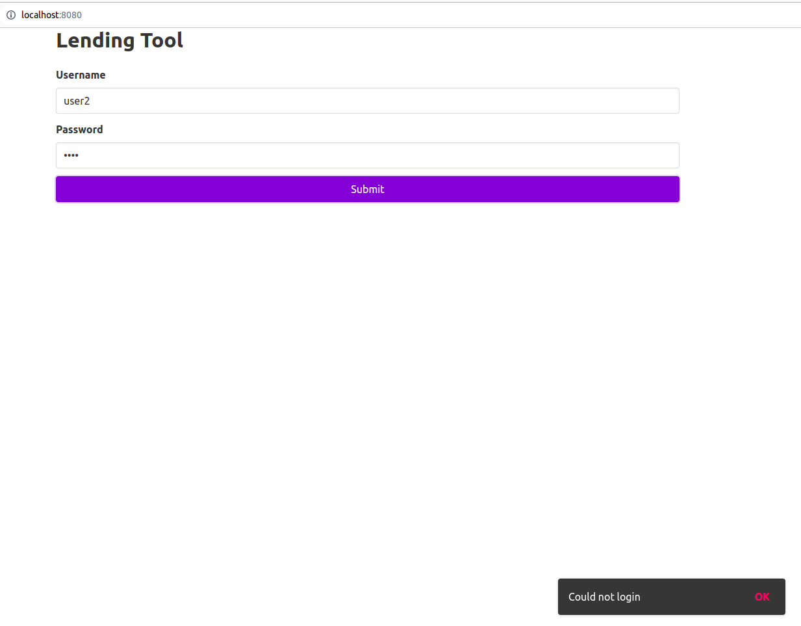
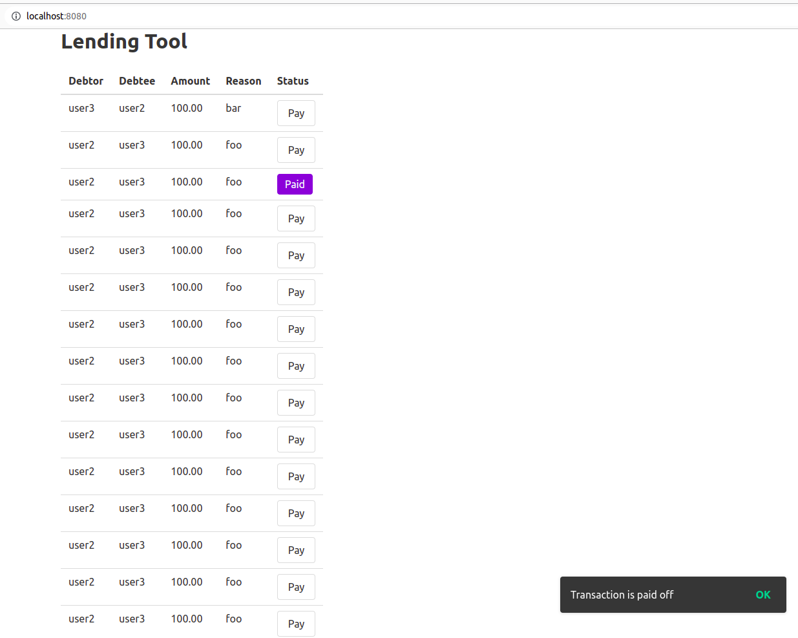

# FS challenge

Run these steps to run the backend. Login as user1, user2 or user3 after populating the data. Usernames are same as passwords.

```shell
$ cd backend
$ pip install -r requirements.txt
$ python3 manage.py migrate
# Test everything is working as intended
$ python3 manage.py test app
# This creates 3 fake users user1, user2, user3 with same passwords. 
# Of these, user2 and user3 have transactions to each other
$ python3 manage.py populatefakedata
# Run local server
$ python3 manage.py runserver
```

```shell
 $ cd frontend
 $ npm install
 $ npm run serve
# Then open http://localhost:8080/ and login with user1, user2, user3
# Usernames are same as passwords
```


## Limitations due to limited time
* No proper sessions. CSRF and other security measures may be disabled.
* Only dev mode of Vue is used, production mode is not supported yet.
* Adding transactions in UI was not implemented.
* UI follows only happy path logic. Responsed in API are brief and may lead to state states.
* Unit tests were written only for server side.

## Screenshots

### Login



### Transactions
